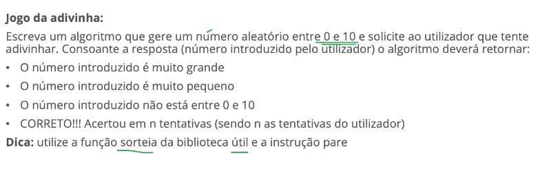

# Programação e Bases de Dados

## 0804 - Algoritmos

### Calculadora de IMC (João Correia e Pedro Marques)

```portugol
programa {
  inclua biblioteca Matematica
  funcao inicio() {
    inteiro altura =0, idade = 0
    real peso = 0.0
    escreva("- Calculador de IMC - \n\n")

    // Verificar se dados introduzidos pelo utilizador estão dentro de um minimo e máximo aceitáveis.
    enquanto (idade > 120 ou idade < 6) {
      escreva("Introduza a sua idade: ")
      leia(idade)
      se (idade > 120 ou idade < 6) escreva("Idade inválida, a idade minima é de 6 anos e máxima de 120 anos. \n")
    }
    enquanto (altura> 300 ou altura < 20) {
      escreva("Introduza a sua altura em cm: ")
      leia(altura)
      se (altura > 300 ou altura < 20) escreva("Altura inválida, a altura minima é 20cm e máxima é 300cm. \n")
    }
    enquanto (peso > 500 ou peso < 10) {
      escreva("Introduza o seu peso em kg: ")
      leia(peso)
      se (peso > 500 ou peso < 10) escreva("Peso inválido, o peso minimo é de 10kg e o máximo é de 500kg. \n")
    }

    // Cálculo do IMC arredondado a duas casas décimais.
    real imc = Matematica.arredondar(peso / ((altura/100)^2), 2)
    escreva("\nO seu IMC é " + imc + " e a sua categoria de peso é: ")

    // Verificar se tem peso normal, a mais ou a menos pelo IMC e idade da pessoa.
    // Crianças entre os 6 e 8 anos:
    se (idade >= 6 e idade < 9){
      se (imc < 15.5) {
        escreva("Peso Baixo. \n")
      } senao se (imc >= 15.5 e imc < 17.5) {
          escreva("Peso Normal. \n")
      } senao {
        escreva("Excesso de Peso. \n")
      }
    } 
    // Crianças entre os 9 e 12 anos:
    se (idade >= 9 e idade < 13) {
      se (imc < 17.5) {
        escreva("Peso Baixo. \n")
      } senao se (imc >= 17.5 e imc < 19.5) {
        escreva("Peso Normal. \n")
      } senao {
        escreva("Excesso de Peso. \n")
      }
    }
    // Crianças entre os 13 e 15 anos:
    se (idade >= 13 e idade < 16) {
      se (imc < 20.5){
        escreva("Peso Baixo. \n")
      } senao se (imc >= 20.5 e imc < 23.8){
        escreva("Peso Normal. \n")
      } senao {
        escreva("Excesso de Peso. \n")
      }
    }
    // Pessoas maiores de 16 anos:
    se (idade >= 16) {
      se (imc < 18.5) {
        escreva("Peso Baixo. \n")
      } senao se (imc >= 18.5 e imc < 25) {
        escreva("Peso Normal. \n")
      } senao se (imc >= 25 e imc < 30) {
        escreva("Excesso de Peso. \n")
      } senao se (imc >= 30 e imc < 35) {
        escreva("Obesidade Classe I (Moderada). \n")
      } senao se (imc >= 35 e imc < 40) {
        escreva("Obesidade Classe II (Severa). \n")
      } senao {
        escreva("Obesidade Classe III (Mórbida). \n")
      } 
    }
  }
}


/* $$$ Portugol Studio $$$ 
 * 
 * Esta seção do arquivo guarda informações do Portugol Studio.
 * Você pode apagá-la se estiver utilizando outro editor.
 * 
 * @POSICAO-CURSOR = 79; 
 * @PONTOS-DE-PARADA = ;
 * @SIMBOLOS-INSPECIONADOS = ;
 * @FILTRO-ARVORE-TIPOS-DE-DADO = inteiro, real, logico, cadeia, caracter, vazio;
 * @FILTRO-ARVORE-TIPOS-DE-SIMBOLO = variavel, vetor, matriz, funcao;
 */ 
```

### Jogo da Adivinha



```portugol
  programa {
    inclua biblioteca Util
    funcao inicio() { 
      inteiro valorSorteado = Util.sorteia(0, 10)
      inteiro valorEscolhido = -1
      logico vencedor = falso

      // Pedir valor ao utilizador enquanto não estiver entre 0 e 10.
      enquanto (valorEscolhido > 10 ou valorEscolhido < 0) {
        escreva("Introduza um numero de 0 a 10: ")
        leia(valorEscolhido)
      } 
      // Comparar o valor escolhido com o sorteado e pedir ao utilizador para introduzir outro valor enquanto forem diferentes.
      inteiro numTentativas = 1
      enquanto (vencedor == falso ) {
        se (valorEscolhido > valorSorteado) {
          numTentativas++
          escreva("Valor escolhido demasiado grande. Tente novamente \n")
        }
        se (valorEscolhido < valorSorteado) {
          numTentativas++
          escreva("Valor escolhido demasiado pequeno. Tente novamente \n")
        } 
        se (valorEscolhido == valorSorteado) {
          vencedor = verdadeiro
          pare
        }
        escreva("Introduza um numero de 0 a 10: ")
        leia(valorEscolhido)
      } 
      //Escrever para o ecran o numero de tentativas quando o utilizador acertar.
      escreva("Valor Correcto. \n")
      escreva("Numero de tentativas até acertar: " + numTentativas)
    }
  }


  /* $$$ Portugol Studio $$$ 
   * 
   * Esta seção do arquivo guarda informações do Portugol Studio.
   * Você pode apagá-la se estiver utilizando outro editor.
   * 
   * @POSICAO-CURSOR = 11; 
   * @PONTOS-DE-PARADA = ;
   * @SIMBOLOS-INSPECIONADOS = ;
   * @FILTRO-ARVORE-TIPOS-DE-DADO = inteiro, real, logico, cadeia, caracter, vazio;
   * @FILTRO-ARVORE-TIPOS-DE-SIMBOLO = variavel, vetor, matriz, funcao;
   */
```

## 0978 - Fundamentos de Python

## 9963 - Web

- [Web Mockup](https://jpscorreia.github.io/web-mockup/)

## 0789 - Programação e Bases de Dados

## 0781 - Análise de Sistemas de Informação

## 0782 - Programação em C
